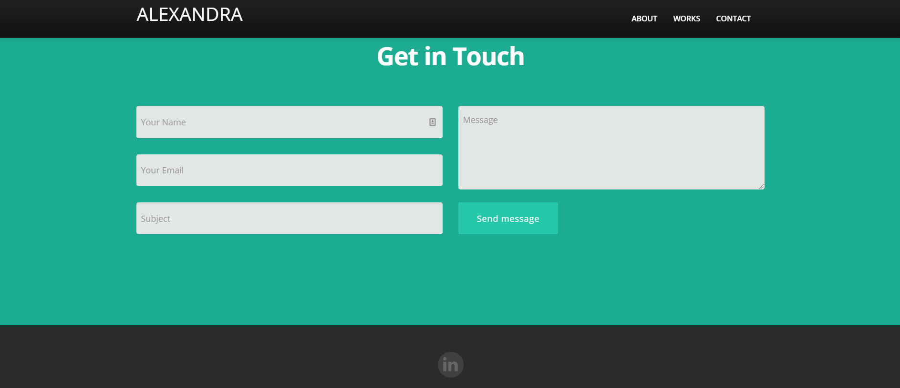

# Portfolio - Alexandra Jackson

## Description

This website is designed to showcase my projects and enable people to contact me.

The website is accessible [here.](https://alexandramj92.github.io/Portfolio/)

## Usage

The navigation bar items link to the different parts of the page. 
The website is designed to be responsive and uses bootstrap. 

The home page has my logo and rotating phrases.

The about page has a description of my background.

The contact page allows a user to input their name, email, and a message that gets sent to my personal email via formspree. The footer contains the linkedin icon that opens a new tab to my linkedin profile.

